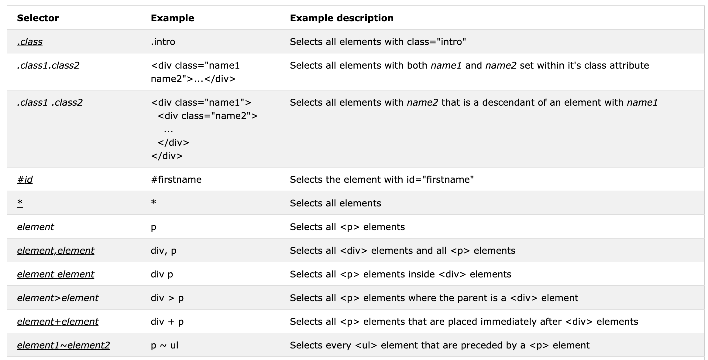

# Selector

**:first-child**

\*\*\*\*

The `:checked` selector matches every checked &lt;input&gt; element \(only for radio buttons and checkboxes\) and &lt;option&gt; element.

The `:root` selector matches the document's root element. ****In HTML, the root element is always the html element.

## Specificity

### inherits from its ancestor  &lt; Directly targeted elements .    all the time

| `` | `#text{color:red;}` | `.text{color:red;} [type="text"]{color:red}` | `span{color:red;}` |
| :--- | :--- | :--- | :--- |

| x,0,0,0 | 0,x,0,0 | 0,0,x,0 | 0,0,0,x |
| :--- | :--- | :--- | :--- |

!important    10000

1. [Type selectors](https://developer.mozilla.org/en-US/docs/Web/CSS/Type_selectors) \(e.g., `h1`\) and pseudo-elements \(e.g., `::before`\).
2. [Class selectors](https://developer.mozilla.org/en-US/docs/Web/CSS/Class_selectors) \(e.g., `.example`\), attributes selectors \(e.g., `[type="radio"]`\) and pseudo-classes \(e.g., `:hover`\).
3. [ID selectors](https://developer.mozilla.org/en-US/docs/Web/CSS/ID_selectors) \(e.g., `#example`\).

* 继承不如指定
* !important &gt; 内联 &gt; ID &gt; Class\|属性\|伪类 Pseudo-classes \| Pseudo-elements&gt; 元素选择器
* :link、:visited、:hover、:active按照LVHA（LoVe HAte）顺序定义

## Specificity Rules

* Equal specificity: the latest rule counts
* ID selectors have a higher specificity than attribute selectors
* Contextual selectors are more specific than a single element selector
* A class selector beats any number of element selectors
* The universal selector and inherited values have a specificity of 0

inline style &gt; ID selector &gt; class, attribute and pseudo-class selector &gt; tag and pseudo-element selector

